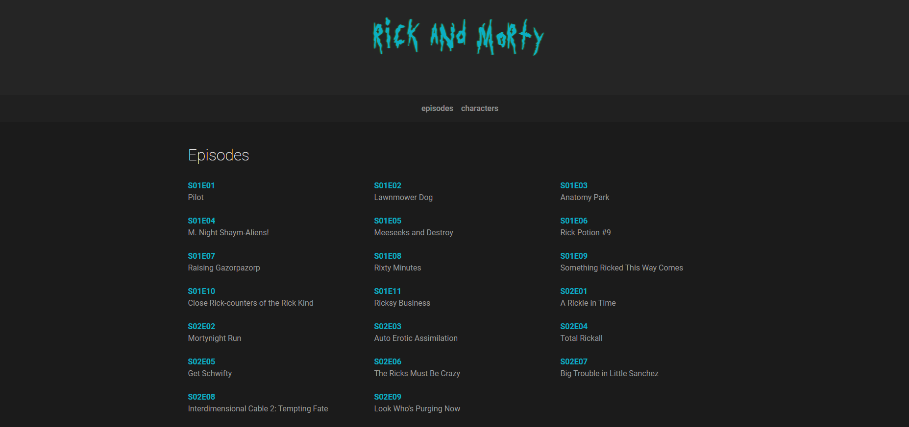

<h1 align="center">
  
  <br>
  Rick and Morty App
</h1>

<h3 align="center">
<strong>Testing Graphql on Angular. <a href="https://rafashiga.github.io/rickandmorty/#/" target="_blank">site</a></strong>
</h3>

<p align="center">

  
  
  
  
  <br>
  <br>
  <a href="#space_invader-technologies">Technologies</a>
  |
  <a href="#information_source-how-to-use">How to use</a>
  <br>
  <br>
  
  <br>
  <br>
</p>

## :space_invader: Technologies

- [Angular 8](https://angular.io/)
- HTML
- Typescript
- SASS
- [Bootstrap 4](https://getbootstrap.com/)
- [Rick and Morty API](https://rickandmortyapi.com/)

## :information_source: How to use

To run this project you'll need [GIT](https://git-scm.com/), [NodeJS](https://nodejs.org/en/) and [Angular](https://angular.io/guide/setup-local) installed on your computer.

```bash
# Clone this repository
$ git clone https://github.com/rafashiga/rickandmorty-app.git

# Go into the repository
$ cd rickandmorty-app

# Install dependencies
$ npm install

# Run the project
$ ng serve
```
